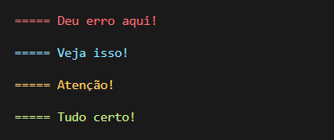
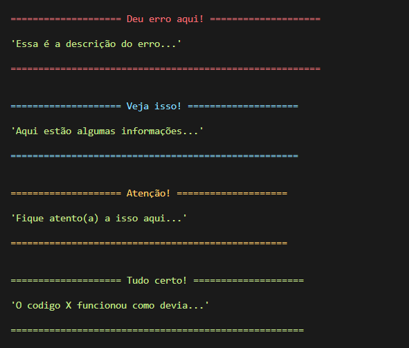
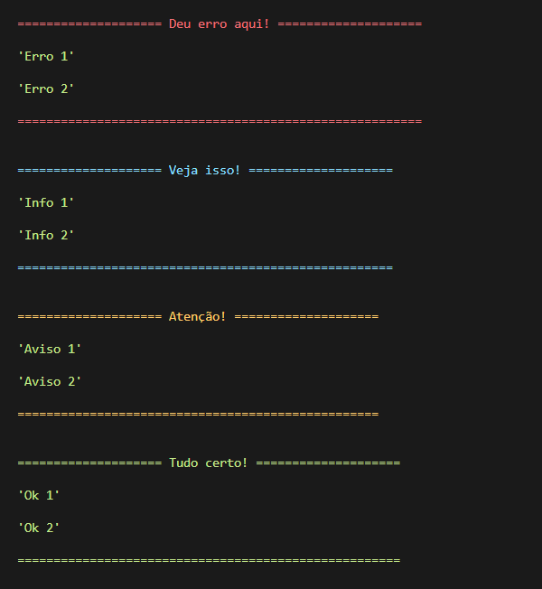
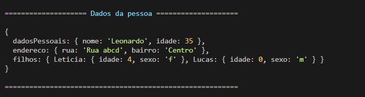

# My Log
Um módulo pra facilitar e melhorar os logs do console

O My Log foi criado para facilitar a leitura dos logs no terminal, com algumas opções interessantes como cores, título e a exibição de forma completa de Objetos.

## Instalação
```
npm i git+https://github.com/lvmasterrj/mylog/#master
```

## Utilização
Funcionamento básico:
```javascript
const log = require("mylog")

log.ok("Tudo certo!")
```

Adicionando cores
```javascript
log.error("Deu erro aqui!")
log.info("Veja isso!")
log.warning("Atenção!")
log.ok("Tudo certo!")
```


Adicionando título
```javascript
log.error("Deu erro aqui!", "Essa é a descrição do erro...")
log.info("Veja isso!", "Aqui estão algumas informações...")
log.warning("Atenção!", "Fique atento(a) a isso aqui...")
log.ok("Tudo certo!", "O codigo X funcionou como devia...")
```


Multiplos parâmetros
```javascript
log.error("Deu erro aqui!", "Erro 1", "Erro 2")
log.info("Veja isso!", "Info 1", "Info 2")
log.warning("Atenção!", "Aviso 1", "Aviso 2")
log.ok("Tudo certo!", "Ok 1", "Ok 2")
```


Objetos
```javascript
let pessoa = {
	dadosPessoais: {
		nome: "Leonardo",
		idade: 35
	},
	endereco: {
		rua: "Rua abcd",
		bairro: "Centro"
	},
	filhos: {
		Leticia: {
			idade: 4,
			sexo: "f",
		},
		Lucas: {
			idade: 0,
			sexo: "m"
		}
	}
}
// Log com título, poderia ser sem também!
log.info("Dados da pessoa", pessoa)
```
